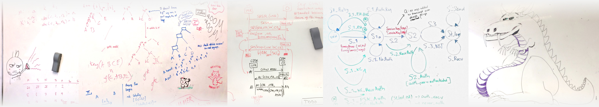
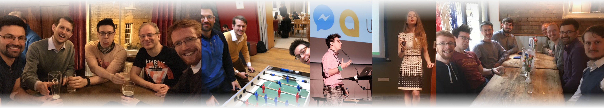

# Multiple open PhD and postdoc positions in security and formal analysis

#### March 26, 2018

Professor [Cas Cremers](https://www.cs.ox.ac.uk/people/cas.cremers/intro.html) is expanding his research group within the recently founded [CISPA-Helmholtz center](https://cispa.saarland/) in Saarbrücken, Germany, and has several open PhD and post-doctoral researcher positions. Please [get in touch](mailto:cas.cremers@cs.ox.ac.uk) if you are interested!

## Our research

Our research focuses around security analysis and communication systems, for which we provide mathematical foundations, analysis tools, and novel security mechanisms.  For example, we contributed to the analysis of the TLS 1.3 and Signal protocols, and co-developed the [Scyther tool](https://www.cs.ox.ac.uk/people/cas.cremers/scyther/) and the [Tamarin prover](https://tamarin-prover.github.io/) for security protocol analysis.

Our methodology typically ranges from theoretical work (formal methods, term rewriting, process calculi, game-hopping proofs, computational and symbolic approaches) to algorithms for analysis tools (e.g., interactive theorem proving, constraint solving), to the development of new protocols (e.g., for the automatic detection of misuse of secrets, or strongly secure group messaging).

For some examples of our work, see:

- [Tamarin prover](https://tamarin-prover.github.io/) and its [theory paper](https://www.cs.ox.ac.uk/people/cas.cremers/downloads/papers/dh_tamarin_extended_v1.pdf)
- [TLS 1.3 protocol analysis](https://tls13tamarin.github.io/TLS13Tamarin/docs/tls13tamarin-draft21.pdf)
- [Signal protocol analysis](https://eprint.iacr.org/2016/1013.pdf)
- [ART protocol design](https://eprint.iacr.org/2017/666.pdf), which is
  the starting point for the development of a new open
  internet standard for secure messaging,
  [Messaging Layer Security](https://tools.ietf.org/html/draft-barnes-mls-protocol-00)

## Candidates

We are looking for excellent students and PhDs. We are particularly interested in attracting a broad range of candidates, and are committed to diversity and inclusion. We also enjoy our work, and feel that the working place should be enjoyable for everyone, and allow for flexible working hours&mdash;ask our alumni and current students for references.

The research group is situated in Saarbrücken, Germany within the [CISPA-Helmholtz center](https://cispa.saarland/). Positions are paid well, according to the relevant German pay scales, and include full benefits.

## Requirements

For a PhD position, we usually require a Master’s degree in a relevant topic at the time of starting.
For a post-doctoral researcher position, we require a relevant PhD degree at the time of starting. However, we encourage candidates to apply early, e.g., when anticipating a finishing date.

Evidence of knowledge in the following backgrounds would be beneficial:

- Formal methods
- Logics
- Theorem proving
- Cryptography

If you have a research idea or proposal already then that is great, but we are also happy to work with good candidates to find a topic that works for all. We have many exciting ongoing research projects.

## Get in touch!

Interested? Send Cas an email at

  [cas.cremers@cs.ox.ac.uk](mailto:cas.cremers@cs.ox.ac.uk)
  
Cas Cremers is currently Professor at the University of Oxford,
and is moving to the CISPA-Helmholtz center June 2018. 
[Research pages](https://www.cs.ox.ac.uk/people/cas.cremers/intro.html) 
[Twitter](https://twitter.com/CasCremers) 

